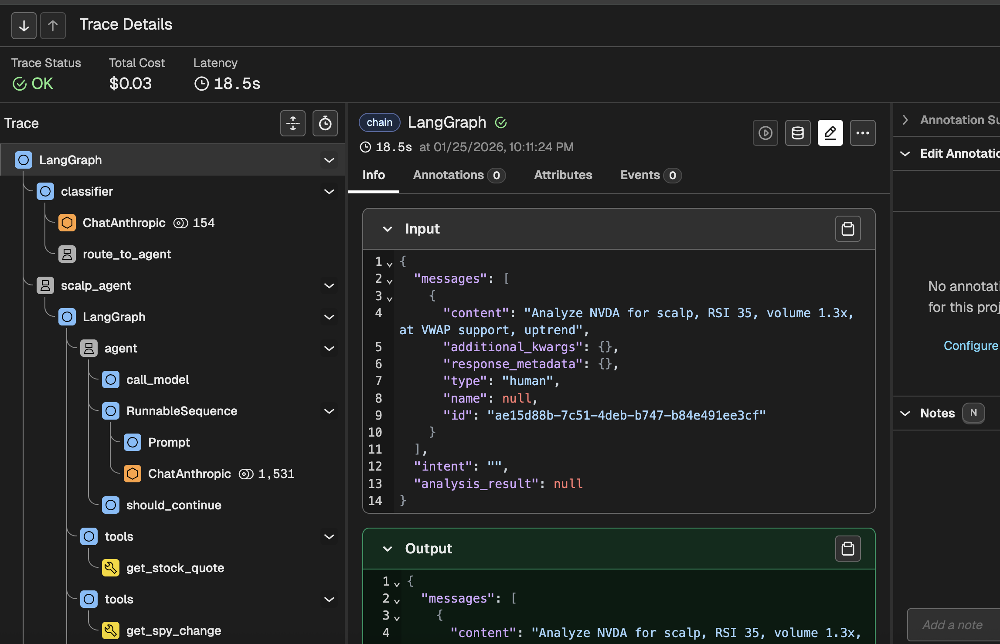
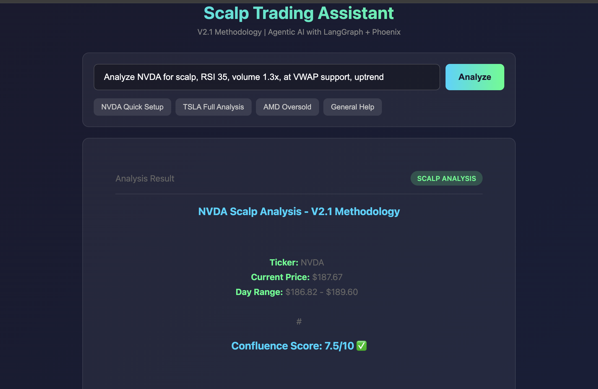

# I Built a Multi-Agent AI System for $0.01 Per Query

**$0.15 per query.** That's what I budgeted for my AI agent system. I spent **$0.01**.

The secret? One simple architectural decision that most tutorials never mention.

---

## The Problem With AI Agent Tutorials

Every tutorial shows you how to build a single agent. But real applications need multiple agents working together—and that's where costs explode.

I wanted to build a trading assistant with:
- An orchestrator that routes queries
- A specialist agent for analysis
- A fallback for general questions
- Full observability (so I could debug it)

Most approaches would have each component calling GPT-4 or Claude Sonnet. At ~$0.05 per call, a single query touching 3 agents = $0.15.

**There had to be a better way.**

---

## The Architecture That Changed Everything


*The key insight: cheap models for routing, expensive models for reasoning*

```
User Query
    │
    ▼
┌──────────────────────────┐
│  ORCHESTRATOR (Haiku)    │  ← $0.001
│  "What does the user     │
│   want?"                 │
└────────────┬─────────────┘
             │
   ┌─────────┴─────────┐
   ▼                   ▼
┌────────┐      ┌────────┐
│ Scalp  │      │Fallback│
│ Agent  │      │ Agent  │
│(Sonnet)│      │(Haiku) │
│ $0.01  │      │ $0.002 │
└────────┘      └────────┘
```

**The insight:** Use cheap models for routing, expensive models only for reasoning.

- **Haiku** (~$0.001/call): Classification, routing, simple queries
- **Sonnet** (~$0.01/call): Complex analysis requiring deep reasoning

Most queries hit the fallback agent. Only complex ones reach Sonnet. Average cost: **$0.01**.

---

## The Code (3 Key Pieces)

### 1. The Orchestrator

```python
from langgraph.graph import StateGraph, START, END

workflow = StateGraph(OrchestratorState)
workflow.add_node("classifier", classify_intent)  # Haiku
workflow.add_node("scalp_agent", scalp_node)      # Sonnet
workflow.add_node("fallback", fallback_node)      # Haiku

workflow.add_edge(START, "classifier")
workflow.add_conditional_edges("classifier", route_by_intent)
```

LangGraph gives you deterministic control. No runaway agent loops.

### 2. The Specialist Agent

```python
from langgraph.prebuilt import create_react_agent

@tool
def get_stock_quote(symbol: str) -> dict:
    """Fetch real market data from Finnhub."""
    # Real API call here
    return {"symbol": symbol, "price": 150.00}

agent = create_react_agent(
    model=ChatAnthropic(model="claude-sonnet-4-20250514"),
    tools=[get_stock_quote, calculate_confluence],
    prompt="You are a scalp trading analyst..."
)
```

### 3. Phoenix Tracing (The Game-Changer)

```python
from phoenix.otel import register

tracer = register(
    project_name="my-agents",
    endpoint="http://localhost:6006/v1/traces"  # Don't forget /v1/traces!
)
```

Now every agent decision is visible:


*Every decision your agent makes—classifier, routing, tool calls—visible in one place*

This saved me hours of debugging. You see exactly why your agent made each decision.

---

## The Gotchas (What Took Me Hours)

**1. Phoenix endpoint needs `/v1/traces`**
Not `localhost:6006`. The full path: `localhost:6006/v1/traces`.

**2. Agent nodes must be async**
```python
# ❌ Wrong
def agent_node(state):
    return agent.invoke(...)

# ✅ Right
async def agent_node(state):
    return await agent.ainvoke(...)
```

**3. Don't recreate agents per request**
```python
_agent = None

def get_agent():
    global _agent
    if _agent is None:
        _agent = create_agent()
    return _agent
```

**4. Fallback agents matter more than you think**

Don't return "I don't understand." Use a real agent with tools—it's still cheap with Haiku and the UX is 10x better.

---

## Results

| Metric | Expected | Actual |
|--------|----------|--------|
| Cost/query | $0.15 | **$0.01** |
| Response time | 10s | **3-5s** |
| Lines of code | 500+ | **350** |


*Real-time analysis with confluence scoring, entry/exit points, and risk management*

---

## Try It Yourself

Everything is open source:

```bash
git clone https://github.com/fabiopiazza59-hue/agentic-flow-demo
cd agentic-flow-demo/simple-MVP
pip install -r requirements.txt
python main.py
```

Open `http://localhost:8000` and start chatting.

**GitHub:** [github.com/fabiopiazza59-hue/agentic-flow-demo](https://github.com/fabiopiazza59-hue/agentic-flow-demo)

---

## What I Learned

Building multi-agent systems isn't about using the most powerful model everywhere. It's about using the **right model** for each task.

Haiku for routing. Sonnet for reasoning. Phoenix for sanity.

Total cost to build this weekend project? About $2 in API calls.

---

*If this helped you, give it a clap. Questions? Drop them in the comments—I'll answer all of them.*

---

**Tags:** `AI` `LangGraph` `Claude` `Python` `Tutorial` `Agents`

---

# ASSETS FOR MEDIUM

## Screenshots Available

| File | Description | Use For |
|------|-------------|---------|
| `demo-ui-start.png` | Initial UI state | Optional |
| `demo-ui-loading.png` | Loading with status | Shows real-time feedback |
| `demo-ui-result.png` | Analysis result | **Main demo screenshot** |
| `phoenix-traces-list.png` | Traces overview | Shows 14 traces, $0.17 total |
| `phoenix-trace-detail.png` | Expanded trace | **Key screenshot - shows hierarchy** |

## Architecture Diagram

Use [Mermaid Live Editor](https://mermaid.live) with content from `simple-MVP/static/architecture.md`

Or use the ASCII art version in the article (works well on Medium).

## To Upload to Medium

1. Copy article text (everything above "ASSETS FOR MEDIUM")
2. Upload images when you see the image placeholders
3. The screenshots are in: `simple-MVP/static/`

## Social Media Snippets

**Twitter/X:**
```
I built a multi-agent AI system this weekend.

Expected cost: $0.15/query
Actual cost: $0.01/query

The secret? Model tiering.

Haiku for routing ($0.001)
Sonnet for reasoning ($0.01)

Full code + tutorial: [link]
```

**LinkedIn:**
```
Just shipped an open-source multi-agent AI demo.

Key insight: Use Haiku ($0.001) for routing, Sonnet ($0.01) for reasoning.

Result: 15x cost reduction.

The architecture:
→ LangGraph orchestrator
→ ReAct specialist agents
→ Phoenix tracing (see every decision)

GitHub + tutorial in comments 👇
```
