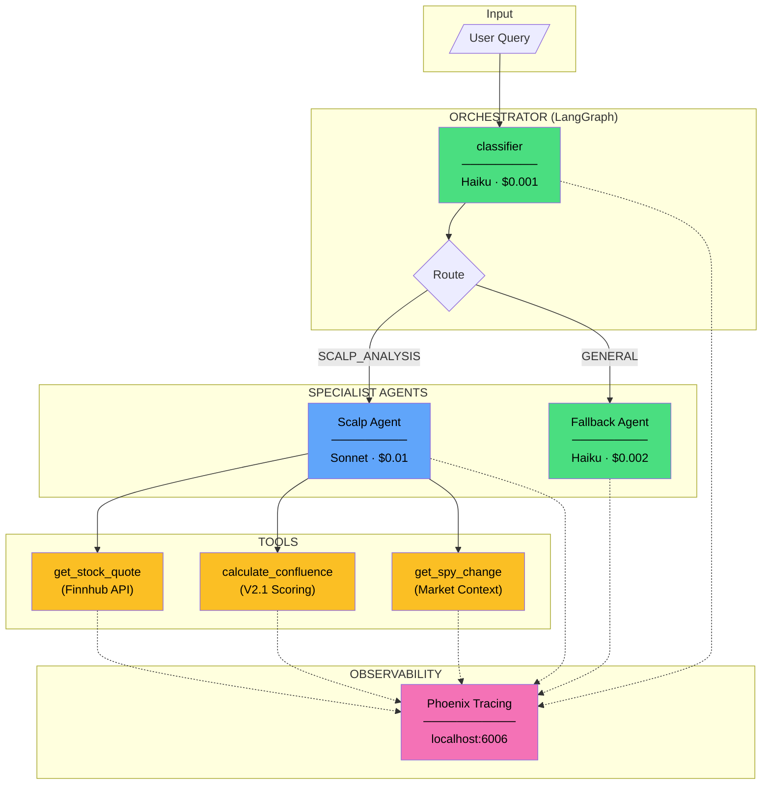
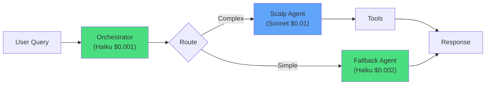

# Architecture Diagram (Mermaid)

Copy this to [Mermaid Live Editor](https://mermaid.live) to generate PNG:



## Simpler Version (for Medium)



## Even Simpler (Text-Based for Medium)

```
User Query
    │
    ▼
┌──────────────────────────┐
│  ORCHESTRATOR (Haiku)    │  ← $0.001
│  "Route to right agent"  │
└────────────┬─────────────┘
             │
   ┌─────────┴─────────┐
   ▼                   ▼
┌────────┐      ┌────────┐
│ Scalp  │      │Fallback│
│ Agent  │      │ Agent  │
│(Sonnet)│      │(Haiku) │
│ $0.01  │      │ $0.002 │
└───┬────┘      └────────┘
    │
    ▼
┌────────────────────────┐
│  TOOLS                 │
│  • get_stock_quote     │
│  • calculate_confluence│
│  • get_spy_change      │
└────────────────────────┘
    │
    ▼
┌────────────────────────┐
│  PHOENIX TRACING       │
│  All spans visible     │
└────────────────────────┘
```
